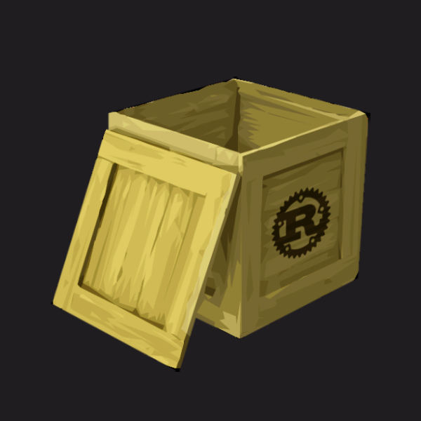
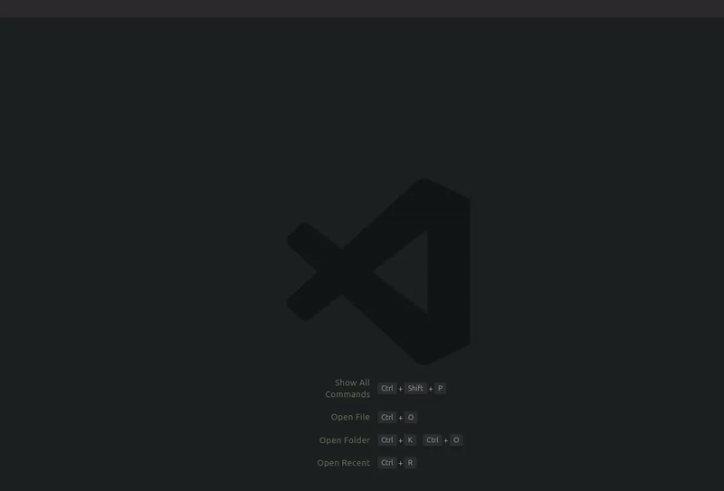

# Go To Rust Crate for VS Code

This extension adds a "Rust Open Crate" command for Rust projects in VS Code. It scans all crates installed on your system, allowing you to pick any crate and open it in a new VS Code window. Perfect for quickly navigating and exploring dependencies of a rust project!

## Installation & Troubleshooting

In VS Code, open the Extensions view and search for **Go To Rust Crate**. Click Install to add the extension.

If you're having issues, ensure that Rust is installed on your system and that there are some crates already available.

## Contributing

If you'd like to contribute, please start by creating an issue to discuss your ideas or proposed changes. Once we've had a chance to review and discuss, you’re welcome to begin working on your contribution.

## Changelog

#### 0.1 - Nov 2024

- Initial release

---
This extension is licensed under the [MIT License](LICENSE).
